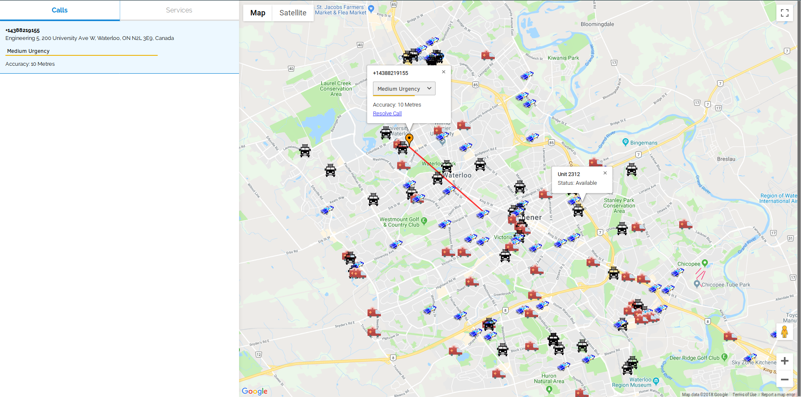

# EmergiCare

Fast, accurate location tracking during emergencies. Hack the North 2016

Context: A lot of the time 911 has no idea where the person is calling from.
https://www.youtube.com/watch?v=A-XlyB_QQYs

Idea: Create a tiny, hidden android app that hooks into emergency numbers. E.g. it autoruns when 911
is called. Upon activation, it will begin to continuously and automatically text a corresponding
emergency number with updating GPS positions. They are then live displayed automatically on a call
receiver's web client. 

Advantages:

 - No extra hardware required
 - Highly efficient and reliable (if you can make a call you can certainly make a text)
 - No data connection needed
 - Only requires a tiny extra android app
 - Very obvious application to society
 - Super easy to use for call operator

Technologies:

 - Node.JS powered web-app 
 - Twilio SMS API
 - Android
 - Any API technologies/prizes that might be applicable?
